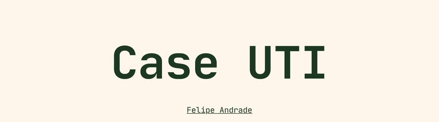

# Previsão de uso de leitos de UTI

  

## 📌 Visão geral
O projeto visa conduzir uma análise exploratória dos dados e construir modelos de machine learning para identificar, no momento de coleta dos primeiros dados de saúde ao chegar no hospital, pacientes que precisarão de leito de UTI. Utilizamos técnicas avançadas de análise de dados, machine learning e balanceamento de dados para identificar padrões e anomalias.

## 💼 Entendimento do Negócio

## 🤖 Modelagem e Avaliação

## 📈 Insights e Conclusões

## 📜 Estrutura do Projeto

├── README.md 
├── requirements.txt
├── data
│ ├── processed
│ └── raw
├── models
├── notebooks
├── reports
│ └── figures
│ └── Apresentação covid.pdf

## 🚧 Próximos Passos